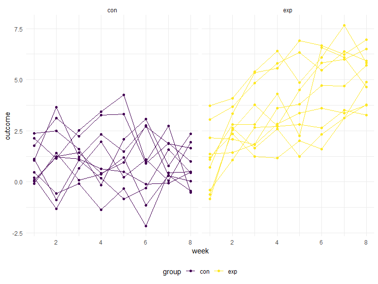

Homework 5
================
2022-11-12

# Problem 1

The code chunk below imports the data in individual spreadsheets
contained in `./data/zip_data/`. To do this, I create a dataframe that
includes the list of all files in that directory and the complete path
to each file. As a next step, I `map` over paths and import data using
the `read_csv` function. Finally, I `unnest` the result of `map`.

``` r
full_df = 
  tibble(
    files = list.files("data/zip_data/"),
    path = str_c("data/zip_data/", files)
  ) %>% 
  mutate(data = map(path, read_csv)) %>% 
  unnest()
```

    ## Rows: 1 Columns: 8
    ## ── Column specification ────────────────────────────────────────────────────────
    ## Delimiter: ","
    ## dbl (8): week_1, week_2, week_3, week_4, week_5, week_6, week_7, week_8
    ## 
    ## ℹ Use `spec()` to retrieve the full column specification for this data.
    ## ℹ Specify the column types or set `show_col_types = FALSE` to quiet this message.
    ## Rows: 1 Columns: 8
    ## ── Column specification ────────────────────────────────────────────────────────
    ## Delimiter: ","
    ## dbl (8): week_1, week_2, week_3, week_4, week_5, week_6, week_7, week_8
    ## 
    ## ℹ Use `spec()` to retrieve the full column specification for this data.
    ## ℹ Specify the column types or set `show_col_types = FALSE` to quiet this message.
    ## Rows: 1 Columns: 8
    ## ── Column specification ────────────────────────────────────────────────────────
    ## Delimiter: ","
    ## dbl (8): week_1, week_2, week_3, week_4, week_5, week_6, week_7, week_8
    ## 
    ## ℹ Use `spec()` to retrieve the full column specification for this data.
    ## ℹ Specify the column types or set `show_col_types = FALSE` to quiet this message.
    ## Rows: 1 Columns: 8
    ## ── Column specification ────────────────────────────────────────────────────────
    ## Delimiter: ","
    ## dbl (8): week_1, week_2, week_3, week_4, week_5, week_6, week_7, week_8
    ## 
    ## ℹ Use `spec()` to retrieve the full column specification for this data.
    ## ℹ Specify the column types or set `show_col_types = FALSE` to quiet this message.
    ## Rows: 1 Columns: 8
    ## ── Column specification ────────────────────────────────────────────────────────
    ## Delimiter: ","
    ## dbl (8): week_1, week_2, week_3, week_4, week_5, week_6, week_7, week_8
    ## 
    ## ℹ Use `spec()` to retrieve the full column specification for this data.
    ## ℹ Specify the column types or set `show_col_types = FALSE` to quiet this message.
    ## Rows: 1 Columns: 8
    ## ── Column specification ────────────────────────────────────────────────────────
    ## Delimiter: ","
    ## dbl (8): week_1, week_2, week_3, week_4, week_5, week_6, week_7, week_8
    ## 
    ## ℹ Use `spec()` to retrieve the full column specification for this data.
    ## ℹ Specify the column types or set `show_col_types = FALSE` to quiet this message.
    ## Rows: 1 Columns: 8
    ## ── Column specification ────────────────────────────────────────────────────────
    ## Delimiter: ","
    ## dbl (8): week_1, week_2, week_3, week_4, week_5, week_6, week_7, week_8
    ## 
    ## ℹ Use `spec()` to retrieve the full column specification for this data.
    ## ℹ Specify the column types or set `show_col_types = FALSE` to quiet this message.
    ## Rows: 1 Columns: 8
    ## ── Column specification ────────────────────────────────────────────────────────
    ## Delimiter: ","
    ## dbl (8): week_1, week_2, week_3, week_4, week_5, week_6, week_7, week_8
    ## 
    ## ℹ Use `spec()` to retrieve the full column specification for this data.
    ## ℹ Specify the column types or set `show_col_types = FALSE` to quiet this message.
    ## Rows: 1 Columns: 8
    ## ── Column specification ────────────────────────────────────────────────────────
    ## Delimiter: ","
    ## dbl (8): week_1, week_2, week_3, week_4, week_5, week_6, week_7, week_8
    ## 
    ## ℹ Use `spec()` to retrieve the full column specification for this data.
    ## ℹ Specify the column types or set `show_col_types = FALSE` to quiet this message.
    ## Rows: 1 Columns: 8
    ## ── Column specification ────────────────────────────────────────────────────────
    ## Delimiter: ","
    ## dbl (8): week_1, week_2, week_3, week_4, week_5, week_6, week_7, week_8
    ## 
    ## ℹ Use `spec()` to retrieve the full column specification for this data.
    ## ℹ Specify the column types or set `show_col_types = FALSE` to quiet this message.
    ## Rows: 1 Columns: 8
    ## ── Column specification ────────────────────────────────────────────────────────
    ## Delimiter: ","
    ## dbl (8): week_1, week_2, week_3, week_4, week_5, week_6, week_7, week_8
    ## 
    ## ℹ Use `spec()` to retrieve the full column specification for this data.
    ## ℹ Specify the column types or set `show_col_types = FALSE` to quiet this message.
    ## Rows: 1 Columns: 8
    ## ── Column specification ────────────────────────────────────────────────────────
    ## Delimiter: ","
    ## dbl (8): week_1, week_2, week_3, week_4, week_5, week_6, week_7, week_8
    ## 
    ## ℹ Use `spec()` to retrieve the full column specification for this data.
    ## ℹ Specify the column types or set `show_col_types = FALSE` to quiet this message.
    ## Rows: 1 Columns: 8
    ## ── Column specification ────────────────────────────────────────────────────────
    ## Delimiter: ","
    ## dbl (8): week_1, week_2, week_3, week_4, week_5, week_6, week_7, week_8
    ## 
    ## ℹ Use `spec()` to retrieve the full column specification for this data.
    ## ℹ Specify the column types or set `show_col_types = FALSE` to quiet this message.
    ## Rows: 1 Columns: 8
    ## ── Column specification ────────────────────────────────────────────────────────
    ## Delimiter: ","
    ## dbl (8): week_1, week_2, week_3, week_4, week_5, week_6, week_7, week_8
    ## 
    ## ℹ Use `spec()` to retrieve the full column specification for this data.
    ## ℹ Specify the column types or set `show_col_types = FALSE` to quiet this message.
    ## Rows: 1 Columns: 8
    ## ── Column specification ────────────────────────────────────────────────────────
    ## Delimiter: ","
    ## dbl (8): week_1, week_2, week_3, week_4, week_5, week_6, week_7, week_8
    ## 
    ## ℹ Use `spec()` to retrieve the full column specification for this data.
    ## ℹ Specify the column types or set `show_col_types = FALSE` to quiet this message.
    ## Rows: 1 Columns: 8
    ## ── Column specification ────────────────────────────────────────────────────────
    ## Delimiter: ","
    ## dbl (8): week_1, week_2, week_3, week_4, week_5, week_6, week_7, week_8
    ## 
    ## ℹ Use `spec()` to retrieve the full column specification for this data.
    ## ℹ Specify the column types or set `show_col_types = FALSE` to quiet this message.
    ## Rows: 1 Columns: 8
    ## ── Column specification ────────────────────────────────────────────────────────
    ## Delimiter: ","
    ## dbl (8): week_1, week_2, week_3, week_4, week_5, week_6, week_7, week_8
    ## 
    ## ℹ Use `spec()` to retrieve the full column specification for this data.
    ## ℹ Specify the column types or set `show_col_types = FALSE` to quiet this message.
    ## Rows: 1 Columns: 8
    ## ── Column specification ────────────────────────────────────────────────────────
    ## Delimiter: ","
    ## dbl (8): week_1, week_2, week_3, week_4, week_5, week_6, week_7, week_8
    ## 
    ## ℹ Use `spec()` to retrieve the full column specification for this data.
    ## ℹ Specify the column types or set `show_col_types = FALSE` to quiet this message.
    ## Rows: 1 Columns: 8
    ## ── Column specification ────────────────────────────────────────────────────────
    ## Delimiter: ","
    ## dbl (8): week_1, week_2, week_3, week_4, week_5, week_6, week_7, week_8
    ## 
    ## ℹ Use `spec()` to retrieve the full column specification for this data.
    ## ℹ Specify the column types or set `show_col_types = FALSE` to quiet this message.
    ## Rows: 1 Columns: 8
    ## ── Column specification ────────────────────────────────────────────────────────
    ## Delimiter: ","
    ## dbl (8): week_1, week_2, week_3, week_4, week_5, week_6, week_7, week_8
    ## 
    ## ℹ Use `spec()` to retrieve the full column specification for this data.
    ## ℹ Specify the column types or set `show_col_types = FALSE` to quiet this message.

The result of the previous code chunk isn’t tidy – data are wide rather
than long, and some important variables are included as parts of others.
The code chunk below tides the data using string manipulations on the
file, converting from wide to long, and selecting relevant variables.

``` r
tidy_df = 
  full_df %>% 
  mutate(
    files = str_replace(files, ".csv", ""),
    group = str_sub(files, 1, 3)) %>% 
  pivot_longer(
    week_1:week_8,
    names_to = "week",
    values_to = "outcome",
    names_prefix = "week_") %>% 
  mutate(week = as.numeric(week)) %>% 
  select(group, subj = files, week, outcome)
```

Finally, the code chunk below creates a plot showing individual data,
faceted by group.

``` r
tidy_df %>% 
  ggplot(aes(x = week, y = outcome, group = subj, color = group)) + 
  geom_point() + 
  geom_path() + 
  facet_grid(~group)
```



This plot suggests high within-subject correlation – subjects who start
above average end up above average, and those that start below average
end up below average. Subjects in the control group generally don’t
change over time, but those in the experiment group increase their
outcome in a roughly linear way.

# Problem 2

## Describe the raw data

In the raw data we see that we have 52,179 observations (criminal
homicides) over the past decade in 51 of the largest American cities.
The data set includes 12 variables including; the location of the
killing, whether an arrest was made and, in most cases, basic
demographic information about each victim. The data set is more specific
than the federal homicide data gathered annually by the FBI from police
agencies nationwide because reporters consulted public records,
including death certificates, court records, and medical examiner
reports, to fill in the gaps.

``` r
homicide_data=
read.csv("homicide-data.csv") %>% 
janitor::clean_names() %>%
  unite("city_state", city:state)
```

## Create a city_state variable and then summarize within the cities to obtain the total number of homicides and the number of unsolved homicides

First I selected what I needed to answer the question (uid, city, state,
disposition). Second I combined the city and state variable so that they
were one. Third, I grouped all the city_state variables into the
disposition (whether the homicide was solved or unsolved). Fourth, I
separated the disposition by their separate identifiers (closed by
arrest, open/no arrest/ closed without arrest). Fifth, I summarized the
values within each disposition identifier so that the values would be
counted. Since I had a series of character variables within the data
set, but not the number of those said variables I counted them by using
the `rowwise` function which allows us to count the character variables
within the row.

Then I created three more columns by using the mutate function. The
unsolved column includes both closed without arrest and open/no arrest,
while the total column includes all three original disposition
identifiers. The percent unsolved column includes the ratio of the
unsolved cases over the total cases.

Then for every data value that had `NA` listed I replaced it with `0` so
later portions of the problem will give actual values.

``` r
tidy_homicide_data=
  read.csv("homicide-data.csv") %>% 
janitor::clean_names() %>%
  unite("city_state", city:state) %>%
  group_by(city_state, disposition) %>% 
  filter(disposition %in% "Closed by arrest" | disposition %in% "Open/No arrest" | disposition %in% "Closed without arrest") %>% 
  summarize(value = n()) %>%
  pivot_wider(names_from = disposition, values_from = value) %>% 
  rowwise() %>% 
  mutate(unsolved = sum(c_across("Closed without arrest": "Open/No arrest")),
         total= sum(c_across("Closed by arrest": "Open/No arrest")),
         percent_unsolved =unsolved/total) 
```

    ## `summarise()` has grouped output by 'city_state'. You can override using the
    ## `.groups` argument.

``` r
tidy_homicide_data[is.na(tidy_homicide_data)] = 0
view(tidy_homicide_data)
```

## For the city of Baltimore, MD, use the prop.test function to estimate the proportion of homicides that are unsolved; save the output of prop.test as an R object, apply the broom::tidy to this object and pull the estimated proportion and confidence intervals from the resulting tidy dataframe.

This code chunk filters Baltimore, MD out of the data set and allows us
to visualize what we are looking at.

``` r
baltimore_df = tidy_homicide_data %>% 
  filter(city_state %in% c("Baltimore_MD"))
baltimore_df
```

    ## # A tibble: 1 × 7
    ## # Rowwise:  city_state
    ##   city_state   `Closed by arrest` Closed without…¹ Open/…² unsol…³ total perce…⁴
    ##   <chr>                     <int>            <int>   <int>   <int> <int>   <dbl>
    ## 1 Baltimore_MD               1002              152    1673    1825  2827   0.646
    ## # … with abbreviated variable names ¹​`Closed without arrest`,
    ## #   ²​`Open/No arrest`, ³​unsolved, ⁴​percent_unsolved

This code chunk uses the `prop.test` function pulls the unsolved and
total columns from the data set to run a one sample t-test with a 95%
confidence interval. From here I tidied the data and then selected out
what we were looking for specifically (estimate, conf.low, conf.high)
and then visualized this data with a table.

``` r
prop.test(x = baltimore_df %>% pull(unsolved), n = baltimore_df %>% pull(total), alternative = c("two.sided"), conf.level = 0.95) %>%
  broom::tidy() %>% 
    select(estimate, conf.low, conf.high) %>% 
knitr::kable(digits = 4, caption = "Table for Baltimore, MD") 
```

| estimate | conf.low | conf.high |
|---------:|---------:|----------:|
|   0.6456 |   0.6276 |    0.6632 |

Table for Baltimore, MD

## Now run prop.test for each of the cities in your dataset, and extract both the proportion of unsolved homicides and the confidence interval for each. Do this within a “tidy” pipeline, making use of purrr::map, purrr::map2, list columns and unnest as necessary to create a tidy dataframe with estimated proportions and CIs for each city

In this code chunk we are creating a function from the original
homicide_data set that we read in. We are telling the function that we
want unsolved to add up all the closed without arrest and open/no arrest
homicides. Then we are telling it to pull out those values.

``` r
  homicide_proptest = function(df){
    results = df  %>% 
    summarize(unsolved = sum(disposition %in% c("Closed without arrest", "Open/No arrest")), total = n())
    
  test = prop.test(x = results %>% pull(unsolved), n = results %>% pull(total))
  return(test)
  }
```

Next we are running a t.test using the `homicide_data` set. We moved
city, state column to the front of the dataset using the relocate
function. Then we are nesting the uid through disposition and calling it
data. From there we are creating `test_results` and `tidy_results` by
mapping the nested data and then mapping the `test_result` that came
from that. From there we want to look at `city_state` in the
`tidy_results` data frame. Since we want to look at all of that we
unnest it and view what we are looking for by using the selcted
function.

``` r
homicide_data %>% 
  relocate(city_state) %>% 
  nest(data = uid:disposition) %>% 
  mutate(test_results = map(data, homicide_proptest), 
         tidy_results = map(test_results, broom::tidy)) %>% 
  select(city_state, tidy_results) %>% 
unnest(tidy_results) %>% 
  select(city_state, estimate, conf.low, conf.high) %>% 
knitr::kable(digits = 4, caption = "Table for All Cities") 
```

| city_state        | estimate | conf.low | conf.high |
|:------------------|---------:|---------:|----------:|
| Albuquerque_NM    |   0.3862 |   0.3373 |    0.4376 |
| Atlanta_GA        |   0.3834 |   0.3528 |    0.4148 |
| Baltimore_MD      |   0.6456 |   0.6276 |    0.6632 |
| Baton Rouge_LA    |   0.4623 |   0.4142 |    0.5110 |
| Birmingham_AL     |   0.4338 |   0.3992 |    0.4690 |
| Boston_MA         |   0.5049 |   0.4646 |    0.5451 |
| Buffalo_NY        |   0.6123 |   0.5688 |    0.6541 |
| Charlotte_NC      |   0.2999 |   0.2661 |    0.3359 |
| Chicago_IL        |   0.7359 |   0.7240 |    0.7474 |
| Cincinnati_OH     |   0.4452 |   0.4080 |    0.4831 |
| Columbus_OH       |   0.5304 |   0.5002 |    0.5605 |
| Dallas_TX         |   0.4812 |   0.4562 |    0.5062 |
| Denver_CO         |   0.5417 |   0.4846 |    0.5977 |
| Detroit_MI        |   0.5883 |   0.5688 |    0.6076 |
| Durham_NC         |   0.3659 |   0.3096 |    0.4261 |
| Fort Worth_TX     |   0.4645 |   0.4223 |    0.5072 |
| Fresno_CA         |   0.3470 |   0.3051 |    0.3914 |
| Houston_TX        |   0.5075 |   0.4892 |    0.5257 |
| Indianapolis_IN   |   0.4493 |   0.4223 |    0.4766 |
| Jacksonville_FL   |   0.5111 |   0.4820 |    0.5401 |
| Kansas City_MO    |   0.4084 |   0.3804 |    0.4370 |
| Las Vegas_NV      |   0.4142 |   0.3881 |    0.4407 |
| Long Beach_CA     |   0.4127 |   0.3629 |    0.4643 |
| Los Angeles_CA    |   0.4900 |   0.4692 |    0.5109 |
| Louisville_KY     |   0.4531 |   0.4121 |    0.4948 |
| Memphis_TN        |   0.3190 |   0.2957 |    0.3433 |
| Miami_FL          |   0.6048 |   0.5686 |    0.6400 |
| Milwaukee_wI      |   0.3614 |   0.3333 |    0.3905 |
| Minneapolis_MN    |   0.5109 |   0.4585 |    0.5631 |
| Nashville_TN      |   0.3625 |   0.3286 |    0.3977 |
| New Orleans_LA    |   0.6485 |   0.6231 |    0.6732 |
| New York_NY       |   0.3876 |   0.3494 |    0.4271 |
| Oakland_CA        |   0.5364 |   0.5041 |    0.5685 |
| Oklahoma City_OK  |   0.4851 |   0.4468 |    0.5236 |
| Omaha_NE          |   0.4132 |   0.3653 |    0.4627 |
| Philadelphia_PA   |   0.4478 |   0.4300 |    0.4657 |
| Phoenix_AZ        |   0.5514 |   0.5185 |    0.5839 |
| Pittsburgh_PA     |   0.5341 |   0.4943 |    0.5735 |
| Richmond_VA       |   0.2634 |   0.2229 |    0.3083 |
| San Antonio_TX    |   0.4286 |   0.3948 |    0.4630 |
| Sacramento_CA     |   0.3697 |   0.3212 |    0.4209 |
| Savannah_GA       |   0.4675 |   0.4041 |    0.5319 |
| San Bernardino_CA |   0.6182 |   0.5577 |    0.6753 |
| San Diego_CA      |   0.3796 |   0.3354 |    0.4258 |
| San Francisco_CA  |   0.5068 |   0.4681 |    0.5454 |
| St. Louis_MO      |   0.5397 |   0.5154 |    0.5637 |
| Stockton_CA       |   0.5991 |   0.5517 |    0.6447 |
| Tampa_FL          |   0.4567 |   0.3881 |    0.5270 |
| Tulsa_OK          |   0.3310 |   0.2932 |    0.3711 |
| Tulsa_AL          |   0.0000 |   0.0000 |    0.9454 |
| Washington_DC     |   0.4379 |   0.4112 |    0.4649 |

Table for All Cities

## Create a plot that shows the estimates and CIs for each city – check out geom_errorbar for a way to add error bars based on the upper and lower limits. Organize cities according to the proportion of unsolved homicides.

Now I have named what I did above `final`. Then I created a plot. I
filtered out Tulsa, AL because it has no values. This could be do to
data entry error.

``` r
final <- homicide_data %>% 
  relocate(city_state) %>% 
  nest(data = uid:disposition) %>% 
  mutate(test_results = map(data, homicide_proptest), 
         tidy_results = map(test_results, broom::tidy)) %>% 
  select(city_state, tidy_results) %>% 
unnest(tidy_results) %>% 
  select(city_state, estimate, conf.low, conf.high)

final %>% 
  filter(city_state != "Tulsa, AL") %>% 
  mutate(city_state = fct_reorder(city_state, estimate)) %>% 
  ggplot(aes(x =city_state, y = estimate)) +
  geom_line() +
  geom_point() +
  geom_errorbar(aes(ymin = conf.low, ymax = conf.high), width = 0.2,
                position=position_dodge(0.05)) +
  theme(axis.text.x = element_text(angle = 90))
```

    ## geom_path: Each group consists of only one observation. Do you need to adjust
    ## the group aesthetic?


# Problem 3

## When designing an experiment or analysis, a common question is whether it is likely that a true effect will be detected – put differently, whether a false null hypothesis will be rejected. The probability that a false null hypothesis is rejected is referred to as power, and it depends on several factors, including: the sample size; the effect size; and the error variance. In this problem, you will conduct a simulation to explore power in a one-sample t-test.

### First set the following design elements: Fix n=30. Fix σ=5. Set μ=0. Generate 5000 datasets from the model.

Created a function and embedded a tibble data frame within it, using the
parameters outlined in the question. Called on a t-test to run the data
we created. Then I tidied it and selected for estimate and p-value.
Afterward created a `sim_results` to run 5000 iterations where mu is
numbers 0 through 6.

``` r
#rerun(5000, rnorm(n = 30, mean = 0, sd= 5))

trial = function(mu){
  tibble_df = tibble(x = rnorm(n = 30, mean = mu, sd= 5))
  t.test(tibble_df) %>% 
    broom::tidy() %>% 
    select(estimate, p.value)
}

sim_results = expand.grid(mu = c(0,1,2,3,4,5,6), run = 1:5000) %>% 
mutate(value = map(mu, trial)) %>% 
unnest(value)
```

In this code chunk we made a column called `compare_to_alpha` and said
that we will reject any p-value below 0.05, stating all rejections equal
1 and all failures to reject equal to 0. Then we grouped by `mu` and
`compare_to_alpha`. Then we filtered for where all `compare_to_alpha`
equal 1 (rejecting the null) and summarized the number of times that
happened under `n_rej`. Then we created a column where we find the
proportion of all the rejections over 5000.

``` r
sim_decision =
  sim_results %>% 
  mutate(
    compare_to_alpha =ifelse(p.value < 0.05, 1, 0)
  ) %>% 
  group_by(mu, compare_to_alpha) %>% 
  filter(
    compare_to_alpha == 1
  ) %>% 
  summarize(n_rej = n()) %>% 
  mutate(prop =n_rej/5000)
```

    ## `summarise()` has grouped output by 'mu'. You can override using the `.groups`
    ## argument.

``` r
sim_decision
```

    ## # A tibble: 7 × 4
    ## # Groups:   mu [7]
    ##      mu compare_to_alpha n_rej   prop
    ##   <dbl>            <dbl> <int>  <dbl>
    ## 1     0                1   259 0.0518
    ## 2     1                1   937 0.187 
    ## 3     2                1  2777 0.555 
    ## 4     3                1  4464 0.893 
    ## 5     4                1  4940 0.988 
    ## 6     5                1  4998 1.00  
    ## 7     6                1  5000 1

## Make a plot showing the proportion of times the null was rejected (the power of the test) on the y axis and the true value of μ on the x axis. Describe the association between effect size and power.

We created a plot using our sim_decision output. There is a positive
correlation or relationship between effect size and power. The greater
the true mean the more likely we were to reject the null.

``` r
sim_decision %>%  
  ggplot(aes(x= mu, y= prop, color = mu))+
  geom_point() +
  labs(
    x = "True Mean",
    y = "Likelihood of Reject H0",
    title = "Power of the Test")
```


## Make a plot showing the average estimate of μ^ on the y axis and the true value of μ on the x axis. Make a second plot (or overlay on the first) the average estimate of μ^ only in samples for which the null was rejected on the y axis and the true value of μ on the x axis. Is the sample average of μ^ across tests for which the null is rejected approximately equal to the true value of μ? Why or why not?

Reran code from above but included estimate in the group by function.

``` r
sim_decision2 =
  sim_results %>% 
  mutate(
    compare_to_alpha =ifelse(p.value < 0.05, 1, 0)
  ) %>% 
  group_by(mu, compare_to_alpha, estimate) %>% 
  filter(
    compare_to_alpha == 1
  ) %>% 
  summarize(n_rej = n()) %>% 
  mutate(prop =n_rej/5000)
```

    ## `summarise()` has grouped output by 'mu', 'compare_to_alpha'. You can override
    ## using the `.groups` argument.

``` r
sim_decision2
```

    ## # A tibble: 23,375 × 5
    ## # Groups:   mu, compare_to_alpha [7]
    ##       mu compare_to_alpha estimate n_rej   prop
    ##    <dbl>            <dbl>    <dbl> <int>  <dbl>
    ##  1     0                1    -3.42     1 0.0002
    ##  2     0                1    -3.32     1 0.0002
    ##  3     0                1    -3.32     1 0.0002
    ##  4     0                1    -2.96     1 0.0002
    ##  5     0                1    -2.88     1 0.0002
    ##  6     0                1    -2.86     1 0.0002
    ##  7     0                1    -2.75     1 0.0002
    ##  8     0                1    -2.70     1 0.0002
    ##  9     0                1    -2.68     1 0.0002
    ## 10     0                1    -2.64     1 0.0002
    ## # … with 23,365 more rows

Plotting what is being asked and comparing the two. Yes the sample
average of mu across test for which the null is rejected appears to be
approximately equal to the true value of mu. This is the case because we
are estimating.

``` r
plot_compare =
  sim_results %>% 
  ggplot(aes(x = mu, y = estimate)) + geom_point() +
  labs(
    x = "Mu",
    y = "estimate",
    title = "Average Estimate of Mu and True Value")

sim_rej =
  sim_results %>% 
  mutate(compare_to_alpha = ifelse(p.value < 0.05, 1, 0)) %>% 
  group_by(mu, compare_to_alpha, estimate) %>% 
  filter(
    compare_to_alpha == 1
  ) %>% 
  ggplot(
    aes(x = mu, y = estimate)) + geom_point() +
  labs(
    x = "Mu",
    y = "estimate",
    title = "Average Estimate of Mu and Rejected Nulls")

plot_compare / sim_rej
```


